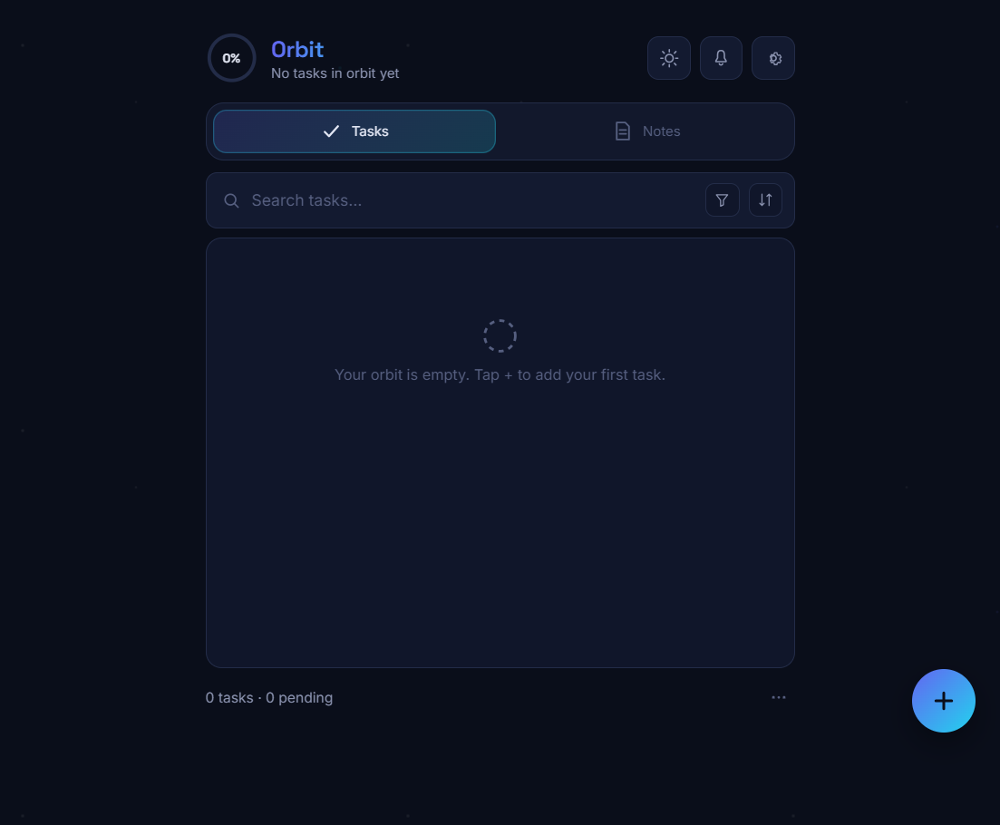

# Orbit — Tasks & Notes

Orbit is a lightweight task and note app built with plain HTML, CSS, and JavaScript. It keeps task management simple with a focused layout, quick tab switching between tasks and notes, search, filters, sorting, reminders, and local storage persistence.

## Features

- Tasks and notes in one workspace
- Search, filter, and sort controls for tasks
- Notes with category tagging
- Reminder and theme controls in settings
- Local storage so content persists between sessions

## Screenshots

### Tasks view

### Notes view

## Tech Stack

- HTML5
- CSS3
- Vanilla JavaScript

## Run Locally

1. Open `index.html` in your browser, or launch it with a local server such as VS Code Live Server.
2. Use the bottom tabs to switch between Tasks and Notes.
3. Add items with the floating action button and manage them from the search, filter, and settings controls.

## Project Structure

- `index.html` - app shell
- `js/` - state, rendering, and interaction logic
- `style/` - visual styling and responsive layout
- `screenshots/` - README images
